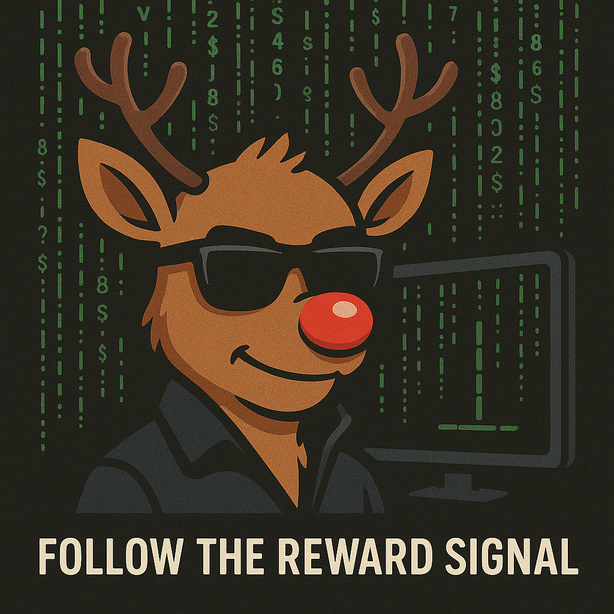

# RudoLF
Multi-paradigm Reinforcement Learning Framework




#### The following project folder is composed of a Gazebo simulator and two python simulator (discrete and continuous env) used to train an agent for autonomous mavigation.

## ROS2 and Gazebo
  - ROS2 Humble
  - Gazebo Garden
Here is how to start the simulation:
```
source path/to/ros/install/setup.bash
cd path/to/vrx/project
./run.sh
source install/setup.bash
ros2 launch competition_custom.launch.py world:=sydney_regatta_custom
```

## Python
The python simulator 
  - Python 3.7
  - Numpy
  - Matplotlib
  - Stable baselines 3
Here is how to start the simulation:
```
python3 continuous_env_PF.py
or
python3 discrete_env_DQN_RL.py
```
